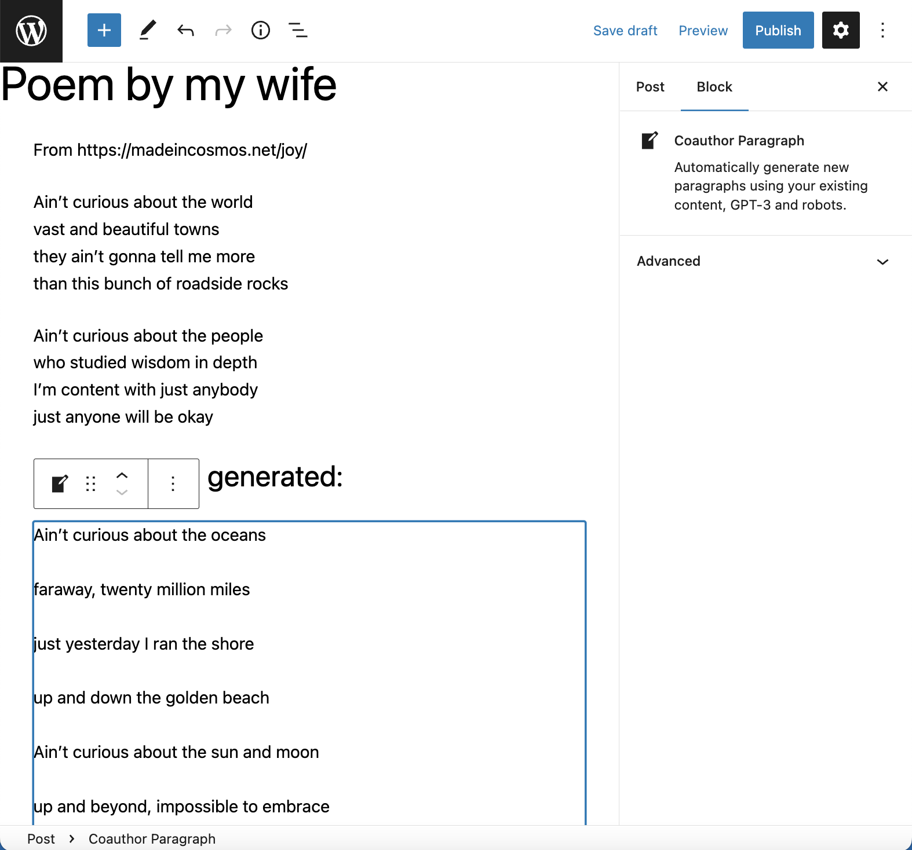
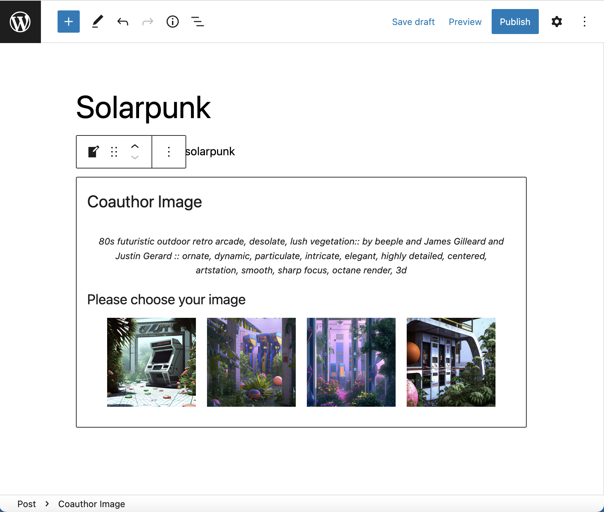

#  WordPress Coauthor - AI Writing assistant

This is a WordPress Gutenberg editor plugin that will put the power of OpenAI in your blog posts.
Are you stuck with your writing? The next paragraph feels like drudgery and you don't know how to continue?
Writers Block Block uses [GPT-3](https://deliber.at/2020/gpt-3/) to generate the next paragraph for you based on your current content of the post.

You need a quick image for your post, but your art skill are failing you? DALL-E will generate an image for you.

## How does it work

[WordPress plugin readme is here](./readme.txt)

### Coauthor Paragraph

- You write some content
- Insert `Coauthor paragraph` block into your post
- It grabs the content of your post, calls OpenAI to generate a completion
- Inserts that completion to your post
- If you like it, you can transform that block into a Paragraph block. If you don't like it - you can delete it.
- This plugin is automatically limiting the requests to one per 10s to protect your OpenAI quota. If you call the suggestion endpoint in succession, you will get the same answer.

### Coauthor Image

* Insert `Coauthor Image` block into your post
* Fill in the prompt to generate an image you would like to see
* It calls OpenAI api to generate 4 images
* You choose one that you like best
* That image gets uploaded to your media gallery and inserted into your post
* Image generations are cached for a month. If you ask for images using the same prompt, you will get the same result.

## Getting started

For development purposes, this installation covers setting up a development environment as well. 

1. **You will need the OpenAI token** - apply [here](https://beta.openai.com/).
2. You will need npm. (Tested with v 6.14)
3. You will need [Docker](https://www.docker.com/products/docker-desktop)
4. Check out this repository
5. `npm install`
6. `npm start` will start WordPress development environment (using `wp-env`) and build appropriate build scripts.
7. Now you can access WP-Admin using http://localhost:8888/wp-admin . Login `admin`, password `password`.
8. Go to editor, write some content.
9.  Use the block editor and search for `Coauthor` block. It will prompt for the OpenAI token first time you use it.
10. Profit.

